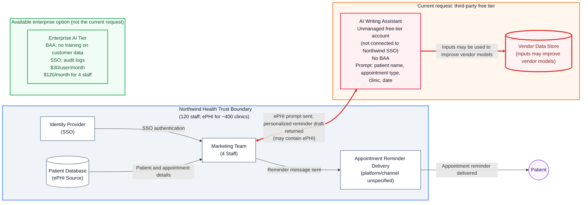

# GRC-Analyst
A fictional GRC case study assessing an AI policy exception request involving patient data at a healthcare SaaS company. It demonstrates evaluating ePHI classification, risk scoring, compliance decisions, and drafting clear stakeholder communication in a regulated environment.

# Scenario

𝐍𝐨𝐫𝐭𝐡𝐰𝐢𝐧𝐝 𝐇𝐞𝐚𝐥𝐭𝐡, a 120-person US healthcare SaaS company that stores patient data (ePHI) for around 400 clinics.

𝐓𝐢𝐜𝐤𝐞𝐭 𝐟𝐫𝐨𝐦 𝐲𝐨𝐮𝐫 𝐦𝐚𝐧𝐚𝐠𝐞𝐫:

> "Marketing want an exception to our AI policy. Can you assess it and recommend a decision? Please draft the reply to the Head of Marketing too."
𝐓𝐡𝐞 𝐫𝐞𝐪𝐮𝐞𝐬𝐭 (𝐟𝐫𝐨𝐦 𝐭𝐡𝐞 𝐇𝐞𝐚𝐝 𝐨𝐟 𝐌𝐚𝐫𝐤𝐞𝐭𝐢𝐧𝐠)

> "We'd like to use a free AI writing assistant to personalise appointment reminder messages. The team would paste in the patient's first name, appointment type, clinic, and date. It would save us around 10 hours a week. Can we get an exception?"
𝐍𝐨𝐫𝐭𝐡𝐰𝐢𝐧𝐝 𝐩𝐨𝐥𝐢𝐜𝐲 𝐞𝐱𝐜𝐞𝐫𝐩𝐭

> 𝐀𝐜𝐜𝐞𝐩𝐭𝐚𝐛𝐥𝐞 𝐔𝐬𝐞 𝐏𝐨𝐥𝐢𝐜𝐲, 𝟒.𝟑: ePHI must not be entered into any system that has not been approved by Security and covered by a Business Associate Agreement (BAA) where required.

𝐖𝐡𝐚𝐭 𝐲𝐨𝐮 𝐤𝐧𝐨𝐰 𝐚𝐛𝐨𝐮𝐭 𝐭𝐡𝐞 𝐭𝐨𝐨𝐥
- The free tier's terms allow user inputs to be used to improve the vendor's models
- No BAA is available on the free tier
- An enterprise tier exists at $30 per user per month: it includes a BAA, no training on customer data, SSO, and audit logs
- The marketing team has four people

𝐘𝐨𝐮𝐫 𝐝𝐞𝐥𝐢𝐯𝐞𝐫𝐚𝐛𝐥𝐞𝐬

1. 𝐈𝐬 𝐭𝐡𝐢𝐬 𝐞𝐏𝐇𝐈? Answer yes or no and explain why.
2. 𝐒𝐜𝐨𝐫𝐞 𝐭𝐡𝐞 𝐫𝐢𝐬𝐤 of approving the request as written, using Likelihood × Impact on a 1-5 scale, with one sentence justifying each number.
3. 𝐘𝐨𝐮𝐫 𝐝𝐞𝐜𝐢𝐬𝐢𝐨𝐧: approve, deny, or approve with conditions. If conditions, list them.
4. 𝐘𝐨𝐮𝐫 𝐫𝐞𝐩𝐥𝐲 𝐭𝐨 𝐭𝐡𝐞 𝐇𝐞𝐚𝐝 𝐨𝐟 𝐌𝐚𝐫𝐤𝐞𝐭𝐢𝐧𝐠: 200 words maximum, no jargon, and offer a way forward rather than just a "no."
𝐵𝑜𝑛𝑢𝑠 𝑝𝑜𝑖𝑛𝑡 𝑓𝑜𝑟 𝑡ℎ𝑒 𝑏𝑒𝑠𝑡 𝑖𝑑𝑒𝑎 𝑡ℎ𝑎𝑡 𝑠𝑜𝑙𝑣𝑒𝑠 𝑀𝑎𝑟𝑘𝑒𝑡𝑖𝑛𝑔'𝑠 𝑝𝑟𝑜𝑏𝑙𝑒𝑚 𝑤𝑖𝑡ℎ𝑜𝑢𝑡 𝑎𝑛𝑦 𝑝𝑎𝑡𝑖𝑒𝑛𝑡 𝑑𝑎𝑡𝑎 𝑙𝑒𝑎𝑣𝑖𝑛𝑔 𝑁𝑜𝑟𝑡ℎ𝑤𝑖𝑛𝑑 𝑎𝑡 𝑎𝑙𝑙.

# Findings 
 
Path: [GRC]

## Deliverable 1 Determination of ePHI 

1. [The combination of patient's first name, appointment type, clinic, and date is ePHI. Sections 164.514(b) of the HIPPA privacy rule, otherwise known as the "Safe Harbour" method for de-identification mandates the removal of 18 types of identifiers. The marketing teams exception request inclusion of the patients name strictly violates identifier number 1 (Names) and the inclusion of patients appointment date strictly violates identifier 3 (All elements of dates) of the 18 identifiers laid out by Sections 164.514(b).]

  
 **Architecture**

2. [

## Risk Rating and Justification 
  
**R-001** – Risk of leaking patient data and breaking privacy laws because Marketing uses free AI tools with real patient details.
**Rating** 25/25 
**Justification**

**R-002** – Risk of patients being identified because outside AI vendors keep and use patient data to train their systems.

**Rating** 16/25

**Justification**

**R-003** – Risk of patient data lingering indefinitely or being accessed improperly due to weak storage and deletion controls in AI software.

**Rating** 16/25

**Justification**

**R-004** – Risk of unauthorized access and former employees keeping system access because AI accounts do not use company login controls (SSO).

**Rating** 12/25 Medium/High

**Justification** Personal logins mean IT cannot enforce strong password policies. When employees leave the company, their access cannot be automatically blocked, creating a back-door security risk.

**R-005** – Risk of patient medical details reaching the wrong person due to outdated, shared, or unverified contact information.

**Rating** 9/25 Medium

**Justification** Sending messages to shared family phones or outdated numbers accidentally exposes private medical appointments to unintended recipients, leading to privacy complaints.

**R-006** –  Risk of privacy breaches and legal penalties because messaging tools lack required vendor contracts (BAAs) and security controls.

**Score** 8/25 Medium

**Justification** Using messaging software without a signed healthcare contract (BAA) violates federal privacy laws (HIPAA), exposing the organization to legal fines during audits.

]

3. [# Approve with Conditions 

## Condition 1: Mitigate R-001 and R-002 ##

_Controls_: ISO 27001 A.5.10, A.5.20 

Immediately cease all use of free-tier AI tools. Marketing must use an approved enterprise-licensed AI platform with explicit contractual guarantees prohibiting vendor retention or training on organization data.

## Condition 2: Mitigate R-003

_Controls_: ISO 27001 A.8.10

Enable automated data retention policies within the AI software to ensure temporary caches, logs, and stored prompts are purged immediately after processing ().

## Condition 4: Mitigate R-004

_Controls_: ISO 27001 A.5.15, A.5.18

Intercept and route all AI software user authentication through Enterprise Single Sign-On (SSO) with Multi-Factor Authentication (MFA) to ensure central control and automated access revocation upon employee offboarding.

## Condition 5: Mitigate R-005 

_Controls_: ISO 27001 A.8.11

Strip specific medical/treatment details from outbound automated messages (e.g., send generic appointment reminders requiring a secure login to view details) to prevent disclosure via shared or outdated contact numbers.

## Condition 6: Mitigate R-006

_Controls_; ISO 27001 A.8.11

Strip specific medical/treatment details from outbound automated messages (e.g., send generic appointment reminders requiring a secure login to view details) to prevent disclosure via shared or outdated contact numbers .

