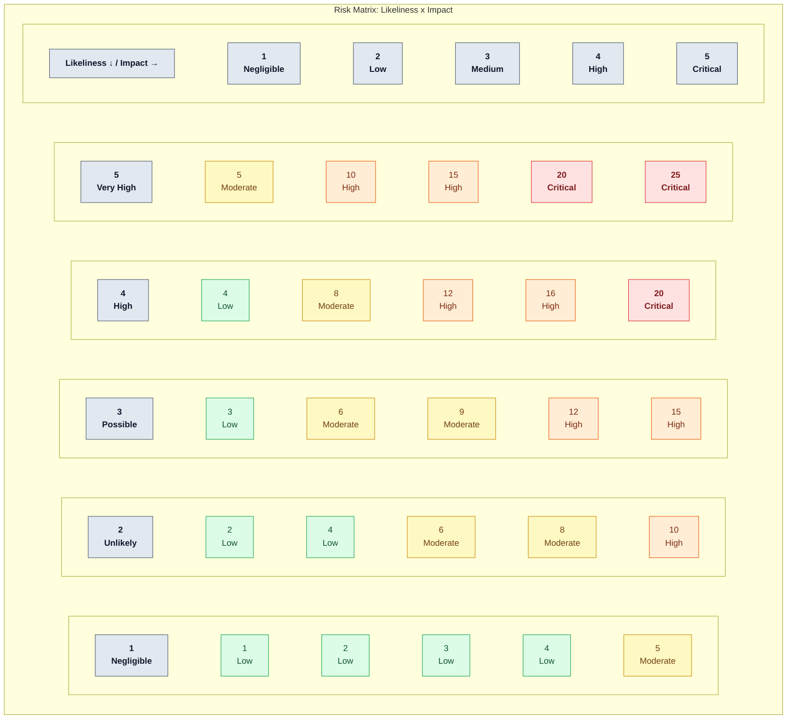

# Establish Risk Criteria: Define risk acceptance criteria and baseline conditions for conducting risk assessments.

## 1. Risk assessment parameters 

Likeliness:

1 = Negligible, unlikely to happen unless under exceptional circumstances. 
2 = Unlikely, not expected to happen frequently 
3 = Possible, may occur at some point 
4 = High, expected to occur in most circumstances. 
5 = Very High, Almost certain. Continuous or frequent occurrence.

Impact; 

1 = Negligible, minimal operational disruption; minor localized impact requiring basic remediation.   
2 = Low, slight disruption; minor financial loss, minimal data exposure, or brief operational delays.  
3 = Medium, moderate operational disruption; customer dissatisfaction, noticeable financial impact, or minor contractual non-compliance.  
4 = High, significant disruption; legal or regulatory non-compliance, severe financial loss, or major brand/reputational damage.   
5 = Critical, existential impact; severe operational shutdown, substantial regulatory fines, loss of critical IP, or catastrophic financial damage.   

## 2. Risk Formula

Overall risk is calculated using the formula

Risk = Likeliness x Impact 

## 3. Risk Acceptance Criteria
* **Low (1–5):** Risk is within appetite. Acceptable; no mandatory remediation needed.
* **Medium (6–12):** Risk owner must evaluate; treatment required if simple controls exist.
* **High / Critical (13–25):** Exceeds risk appetite.

## 4. Baseline Conditions for Assessments
Risk assessment must be conducted prior granting authorisation to action exception request for Northwind Health AI use policy, under the following baseline condition:

"Prior to major system changes, deployments, or architecture alterations"

# Ensure Consistency: Design the assessment process to yield consistent, valid, and comparable results over repeated executions.

Evidence-Based Rationale & Documentation
* **Mandatory Justification:** Every assigned Likeliness and Impact score must be accompanied by a documented rationale.
* **Documented Assumptions:** Any assumptions regarding existing controls, asset boundaries, or operational environments must be explicitly recorded in the Risk Register.

# Risk Identification
Identify Risks: Identify risks related to the loss of security within the ISMS scope, and assign risk owners to each.

## 1. Asset Inventory

The Asset register models of the exception requests projected free tier Ai system that is designed to deliver automated reminders to patients containing ePHI. The Asset inventory can be found [here](https://github.com/nickq1986/GRC-Analyst/blob/main/documents/Northwinds%20Health_Asset_Register.md) 

## 2. Vulnerability Findind
From the register the current vulnerability findings are:

- A005 — Free-tier AI writing assistant: Northwind SSO is not used; no BAA is executed; and the free-tier terms allow inputs to be used to improve the vendor’s models.
- A006 — AI data improvement process: ePHI may be retained and used for model improvement, with no BAA executed.
- A007 — AI database software: It caches ePHI, but the register doesn’t state the cache’s access, protection, retention or deletion controls. Record this as needs validation, not a confirmed vulnerability.
- A009 — Message delivery platform: It processes ePHI, but the register says no BAA is required. Validate the platform’s role and whether that status is correct before calling it a vulnerability.
- A010 — Patient delivery destinations: The owner and safeguards are unspecified. That’s an information gap to investigate; unknown SSO alone doesn’t establish a vulnerability for patient destinations.

## 3. Threat Modelling 

Threats were identified using the  [Northwind LINDDUN threat model](documents/Threat%20Model.md), as follows: 

Marketing’s ePHI prompt to the free-tier AI
1. Linkability (T01): Repeated prompts could be linked to build a patient profile.
2. Identifiability (T02): The prompt details could identify the patient.
3. Disclosure (T03): Identifiable ePHI is sent to the free-tier vendor.
4. Non-compliance (T04): Processing may conflict with Northwind policy or privacy obligations.
   
Vendor storage and model improvement
6. Linkability (T10): Stored prompts could connect a patient’s appointments over time.
7. Identifiability (T11): Stored prompts or cached data could retain patient identifiers.
8. Non-repudiation (T12): Retained records could provide evidence of a patient’s appointment.
9. Detectability (T13): Vendor data or model behavior could reveal that patient data was included.
10. Disclosure (T14): Cached or retained ePHI could be exposed.
    
Reminder delivery and receipt
12. Linkability (T05): Repeated reminders could reveal a patient’s care pattern.
13. Identifiability (T06): Reminder content or records could identify the patient and care context.
14. Non-repudiation (T07): Delivery records could evidence a care relationship.
15. Detectability (T08): A notification could reveal clinic involvement.
16. Disclosure (T09): A shared or incorrect destination could receive ePHI.
Patient awareness and delivery platform

17. Unawareness (T15): Patients may not know a vendor processes reminder data; notice status needs checking.
18. Disclosure (T16): The reminder platform’s ePHI safeguards are not established in the register.
19. Non-compliance (T17): Whether a BAA is required for the reminder platform remains unresolved.

## Risk Identification Methodology

The risk identification process follows the standard security formulation:

Risk = (Vulnerability + Threat)

### Vulnerability-to-threat mapping

| Vulnerability | Mapped LINDDUN threats | Description |
| --- | --- | --- |
| **A005 — Free-tier AI writing assistant** | T01 Linkability; T02 Identifiability; T03 Disclosure; T04 Non-compliance | **T01:** Repeated prompts may be linked into a patient profile. **T02:** Prompt attributes may identify the patient. **T03:** Identifiable ePHI is disclosed to the free-tier vendor. **T04:** Processing may conflict with policy or privacy obligations. |
| **A006 — AI data improvement process** | T01 Linkability; T10 Linkability; T11 Identifiability; T12 Non-repudiation; T13 Detectability; T14 Disclosure | **T01:** Repeated prompts may be linked into a patient profile. **T10:** Training data may link prompts across appointments. **T11:** Stored prompts may retain patient identifiers. **T12:** Retained prompts may evidence an appointment. **T13:** Vendor data or model behavior may reveal patient-data inclusion. **T14:** Retained ePHI may be exposed from vendor storage. |
| **A007 — AI database software/cache** | T11 Identifiability; T12 Non-repudiation; T14 Disclosure | **T11:** Cached prompts may retain patient identifiers. **T12:** Retained cache or session records may evidence an appointment. **T14:** Cached ePHI may be exposed if safeguards are inadequate. |
| **A009 — Message delivery platform** | T05 Linkability; T06 Identifiability; T07 Non-repudiation; T09 Disclosure; T16 Disclosure; T17 Non-compliance | **T05:** Repeated reminders or metadata may reveal a care pattern. **T06:** Reminder content or records may identify the patient and care context. **T07:** Delivery records may evidence a care relationship. **T09:** ePHI may reach a shared or incorrect destination. **T16:** The platform’s ePHI safeguards are not established. **T17:** Whether a BAA is required remains unresolved. |
| **A010 — Patient delivery destinations** | T05 Linkability; T06 Identifiability; T07 Non-repudiation; T08 Detectability; T09 Disclosure | **T05:** Repeated reminders may reveal a care pattern. **T06:** Reminder content may identify the patient and care context. **T07:** Delivery records may evidence a care relationship. **T08:** A notification may reveal clinic involvement. **T09:** A shared or incorrect destination may receive ePHI. |

Analyze Risks: Assess potential consequences, evaluate the realistic likelihood of occurrence, and determine overall risk levels.

Evaluate & Prioritize Risks: Compare analyzed risks against established risk criteria and prioritize them for risk treatment.

Document the Process: Retain documented information covering the entire risk assessment workflow.

