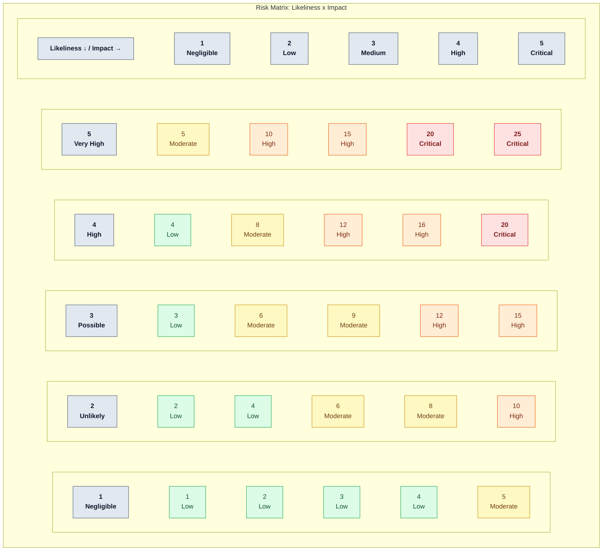
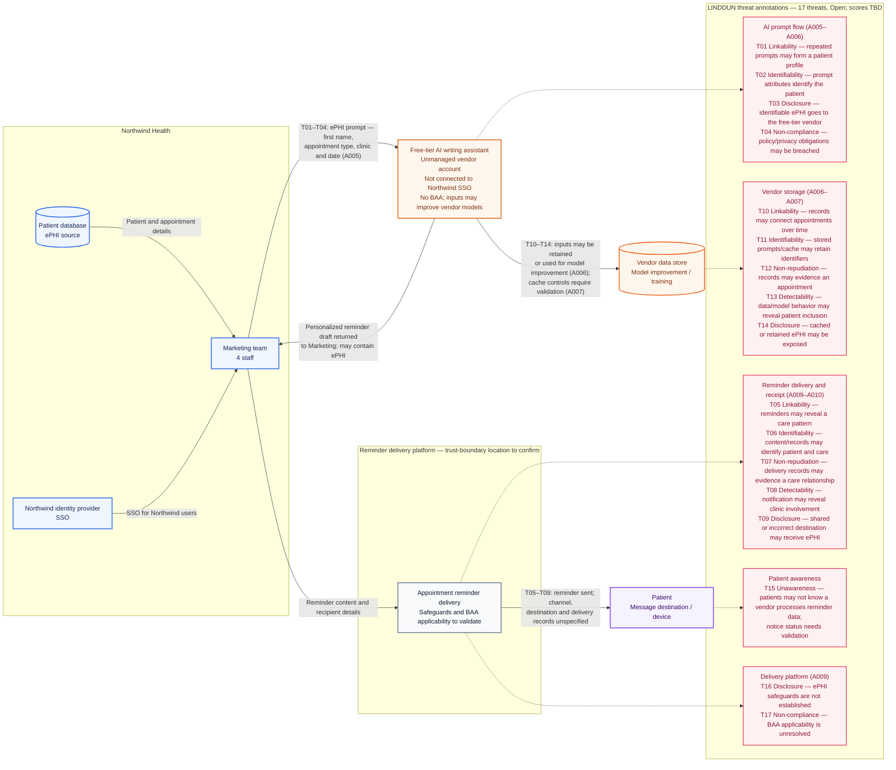

# Establish Risk Criteria: Define risk acceptance criteria and baseline conditions for conducting risk assessments.

## 1. Risk assessment parameters 

Likeliness:

1 = Negligible, unlikely to happen unless under exceptional circumstances. 
2 = Unlikely, not expected to happen frequently 
3 = Possible, may occur at some point 
4 = High, expected to occur in most circumstances. 
5 = Very High, Almost certain. Continuous or frequent occurrence.

Impact; 

1 = Negligible, minimal operational disruption; minor localized impact requiring basic remediation.   
2 = Low, slight disruption; minor financial loss, minimal data exposure, or brief operational delays.  
3 = Medium, moderate operational disruption; customer dissatisfaction, noticeable financial impact, or minor contractual non-compliance.  
4 = High, significant disruption; legal or regulatory non-compliance, severe financial loss, or major brand/reputational damage.   
5 = Critical, existential impact; severe operational shutdown, substantial regulatory fines, loss of critical IP, or catastrophic financial damage.   

## 2. Risk Formula

Overall risk is calculated using the formula

Risk = Likeliness x Impact 

## 3. Risk Acceptance Criteria
* **Low (1–5):** Risk is within appetite. Acceptable; no mandatory remediation needed.
* **Medium (6–12):** Risk owner must evaluate; treatment required if simple controls exist.
* **High / Critical (13–25):** Exceeds risk appetite.

## 4. Baseline Conditions for Assessments
Risk assessment must be conducted prior granting authorisation to action exception request for Northwind Health AI use policy, under the following baseline condition:

"Prior to major system changes, deployments, or architecture alterations"

# Ensure Consistency: Design the assessment process to yield consistent, valid, and comparable results over repeated executions.

Evidence-Based Rationale & Documentation
* **Mandatory Justification:** Every assigned Likeliness and Impact score must be accompanied by a documented rationale.
* **Documented Assumptions:** Any assumptions regarding existing controls, asset boundaries, or operational environments must be explicitly recorded in the Risk Register.

# Identify Risks: Identify risks related to the loss of security within the ISMS scope, and assign risk owners to each.

## 1. Asset Inventory

The Asset register models of the exception requests projected free tier Ai system that is designed to deliver automated reminders to patients containing ePHI. The Asset inventory can be found [here](https://github.com/nickq1986/GRC-Analyst/blob/main/documents/Northwinds%20Health_Asset_Register.md) 

## 2. Vulnerability Findind
From the register the current vulnerability findings are:

- A005 — Free-tier AI writing assistant: Northwind SSO is not used; no BAA is executed; and the free-tier terms allow inputs to be used to improve the vendor’s models.
- A006 — AI data improvement process: ePHI may be retained and used for model improvement, with no BAA executed.
- A007 — AI database software: It caches ePHI, but the register doesn’t state the cache’s access, protection, retention or deletion controls. Record this as needs validation, not a confirmed vulnerability.
- A009 — Message delivery platform: It processes ePHI, but the register says no BAA is required. Validate the platform’s role and whether that status is correct before calling it a vulnerability.
- A010 — Patient delivery destinations: The owner and safeguards are unspecified. That’s an information gap to investigate; unknown SSO alone doesn’t establish a vulnerability for patient destinations.

## 3. Threat Modelling 

The diagram maps the identified LINDDUN threats to the ePHI prompt, vendor storage, and patient reminder flows. Threats remain open for subsequent risk assessment; severity and risk scores are not assigned here.

Analyze Risks: Assess potential consequences, evaluate the realistic likelihood of occurrence, and determine overall risk levels.

Evaluate & Prioritize Risks: Compare analyzed risks against established risk criteria and prioritize them for risk treatment.

Document the Process: Retain documented information covering the entire risk assessment workflow.

