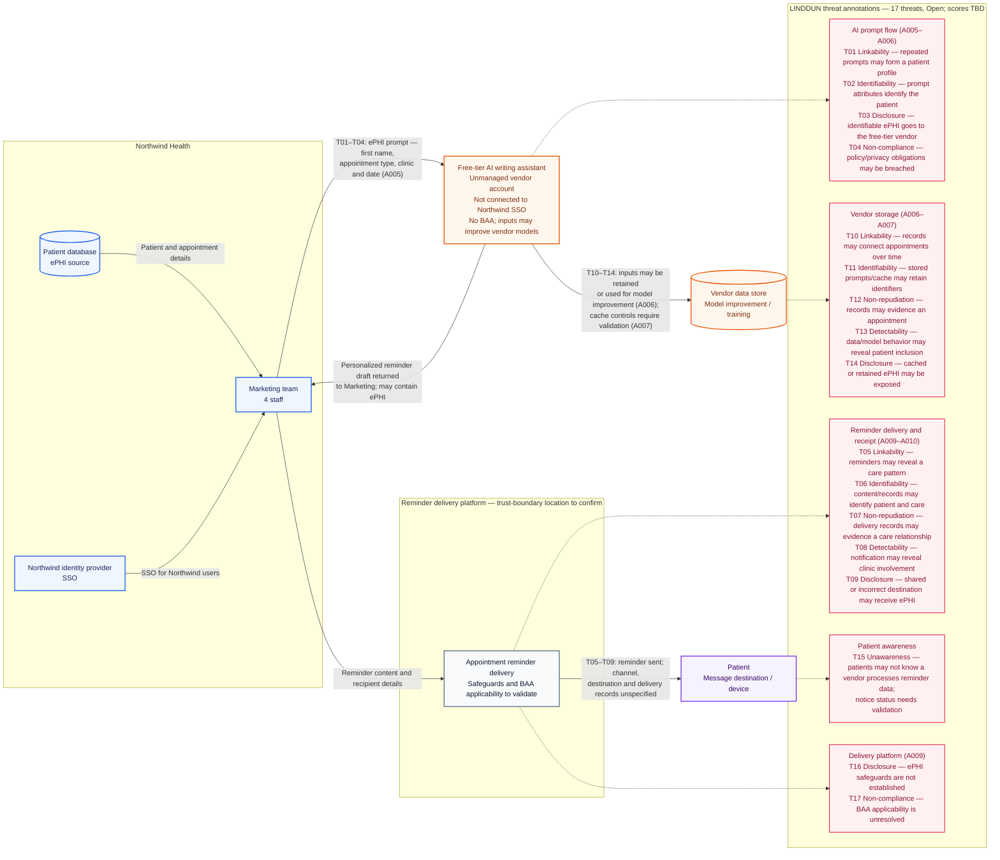

# Northwind Health LINDDUN Threat Model

The diagram maps the identified LINDDUN threats to the ePHI prompt, vendor storage, and patient reminder flows. Threats remain open for subsequent risk assessment; severity and risk scores are not assigned here.

